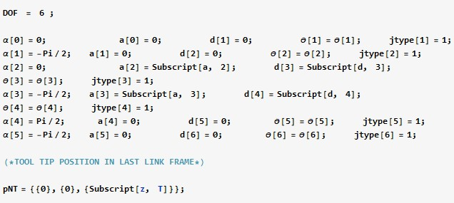
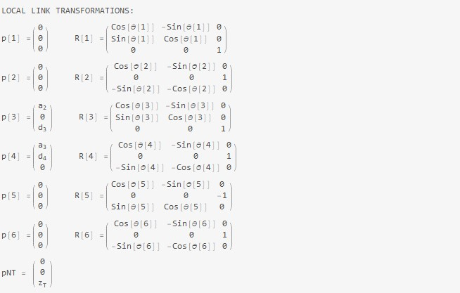
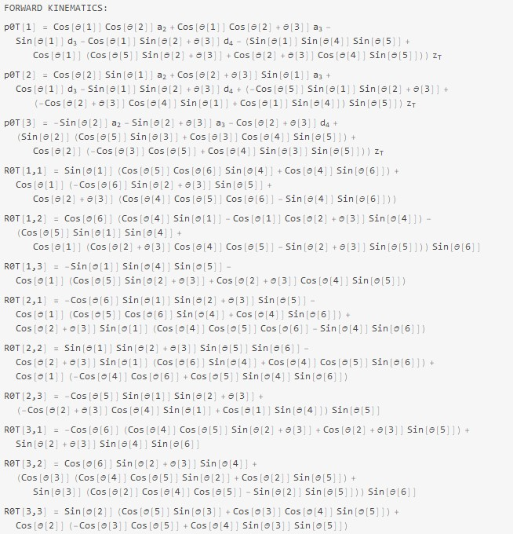
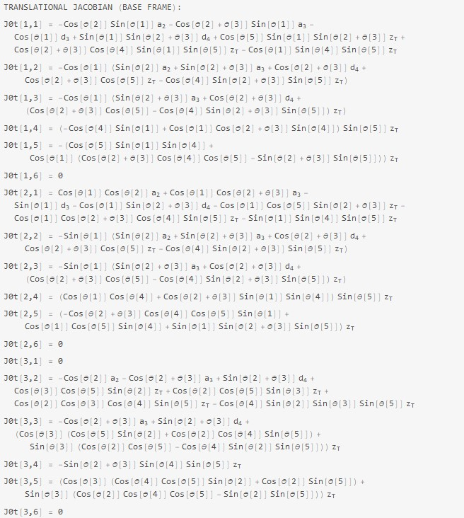
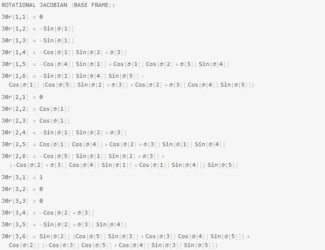
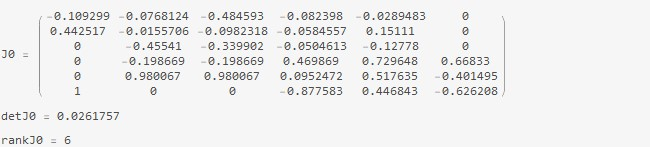

# 1) Forward Kinematics with Transformation Matrix and Jacobian
**Author:** Midhun Varghese  

**GitHub :** https://github.com/midhun-varghese   

## <u>**Code Description:**</u> 

This program can be used to develop the forward kinematics of any serial manipulator from its DH Parameters. The associated transformation matrix and the Jacobian is also calculated. Both the translation Jacobian and Rotational Jacobian are computed.

## **<u>Instructions:</u>**

Specify the Denavit Hartenberg (DH) Parameters and other robot parameters of the Manipulator. For this example, the DH parameters and specifications of the PUMA 560 has been specified.

## **<u>Results</u>**

Local link transformations

#### **Forward Kinematics**

#### Translation Jacobian in Base Frame

#### Rotational Jacobian in Base Frame

#### Full Jacobian Matrix with Singularity Analysis

