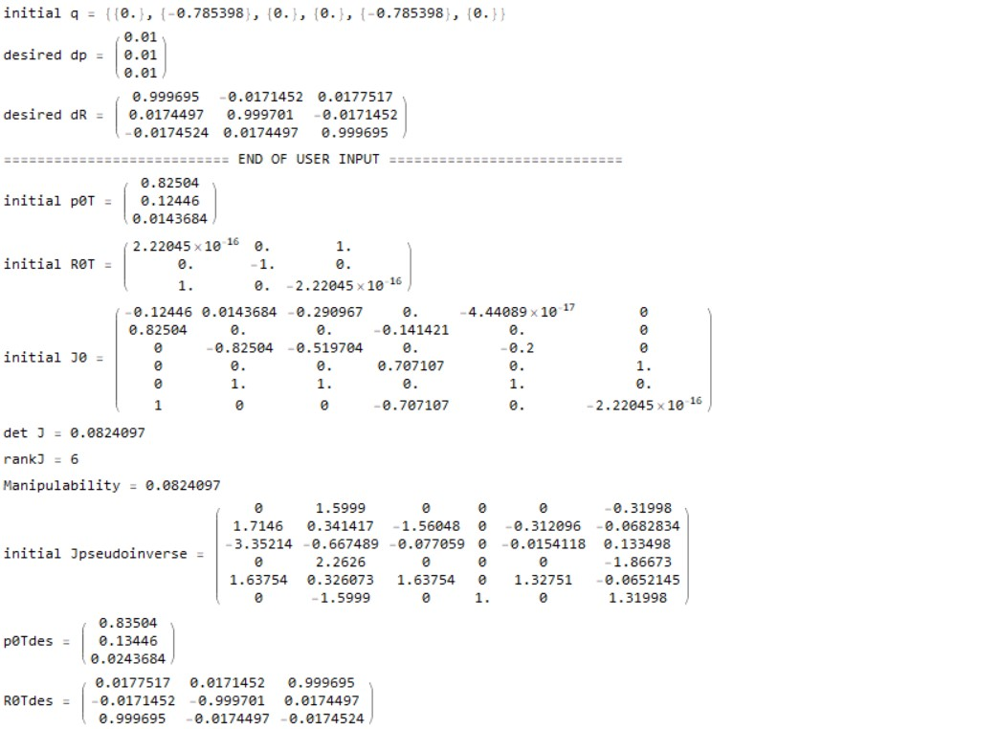
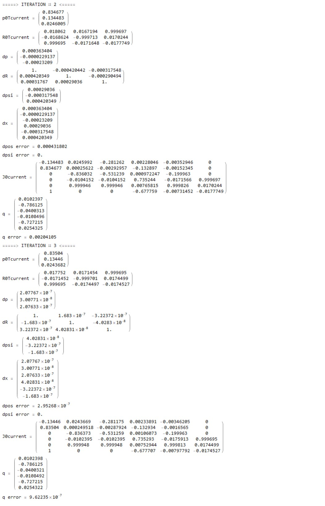

# 2) Inverse Kinematics using Iterative Jacobian Method
**Author:** Midhun Varghese  

**GitHub :** https://github.com/midhun-varghese   

## <u>**Code Description:**</u> 

This program is used to obtain the Inverse Kinematics of a given serial manipulator using the Iterative Jacobian Method. This program maps the tool-space or the workspace of a manipulator with its joint space. For this example, a 3 - R (3 Revolute Joint) Robot is taken as reference.  The program also executes singularity analysis to avoid the singularities if any. In the event that it the manipulator reaches a singularity, the program uses the Pseudoinverse to calculate the Jacobian.  

## **<u>Instructions:</u>**

Before running this program, run the FK_Transformation_Jacobian Program so that the required data is present in Mathematica folder. You may close the program but do not exit out of Mathematica. Specify the Denavit Hartenberg (DH) Parameters and other robot parameters of the Manipulator in the FK_Transformation_Jacobian Program and run the same. 

In this program, specify the initial location/orientation and the desired orientation in terms of the rotation and translation. 

## **<u>Results</u>**

Specification of the initial location/orientation and the desired orientation (rotation and translation)

#### Iterative Jacobian Method

For this specific manipulator that was specifies, this shows that the result converges within 3 Iterations.

